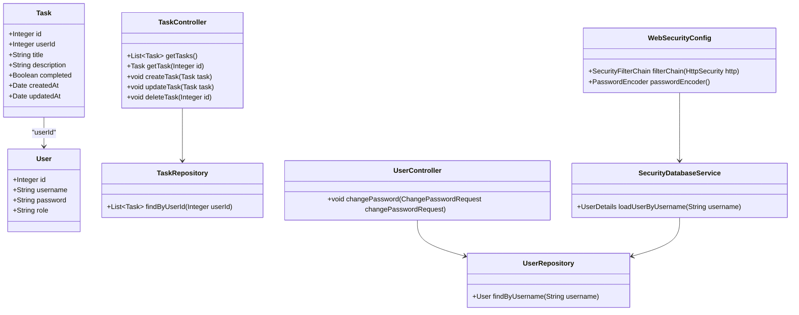

# ☕ TODO List API

## 📜 Descrição

API RESTful para gerenciamento de tarefas (TODO List) desenvolvida em Java. O projeto foi criado visando
aprimorar conhecimentos em programação orientada a objetos e práticas de desenvolvimento de software.

### Endpoints

- GET /tasks - Retorna todas as tarefas do usuário autenticado
- GET /tasks/{id} - Retorna uma tarefa específica por ID do usuário autenticado
- POST /tasks - Cria uma nova tarefa para o usuário autenticado
- PUT /tasks - Atualiza uma tarefa do usuário autenticado
- DELETE /tasks/{id} - Deleta uma tarefa específica por ID do usuário autenticado
- POST /users/register - Registra um novo usuário
- PUT /users/change-password - Altera a senha do usuário autenticado

### Diagrama:

## ⚙️ Construção

Recursos utilizados na construção do projeto.

### 💻 Tecnologias

### 🛠️ Ferramentas

## ✏️ Aprendizado

- Aprofundamento em conhecimentos de programação orientada a objetos em Java;
- Ambiente de desenvolvimento Java configurado;
- Familiarização com o uso de repositórios Git;
- Desenvolvimento de API RESTful utilizando Spring Boot;
- Configuração e utilização do PostgreSQL como banco de dados;
- Implementação de tratamento de exceções para garantir a robustez da aplicação;
- Integração de Spring Security para autenticação e autorização;
- Uso do Spring Data JPA para simplificar o acesso a dados.
## ✒️ Autores

Miguel Angelo Gonzaga Marques - [GitHub](https://github.com/ApenasAngelo)

## 📨 Contato

